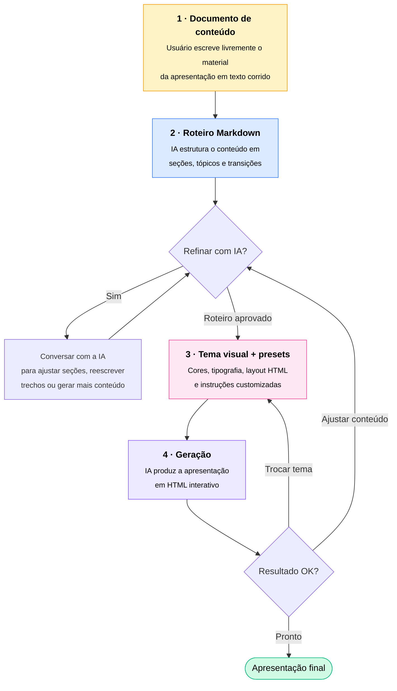
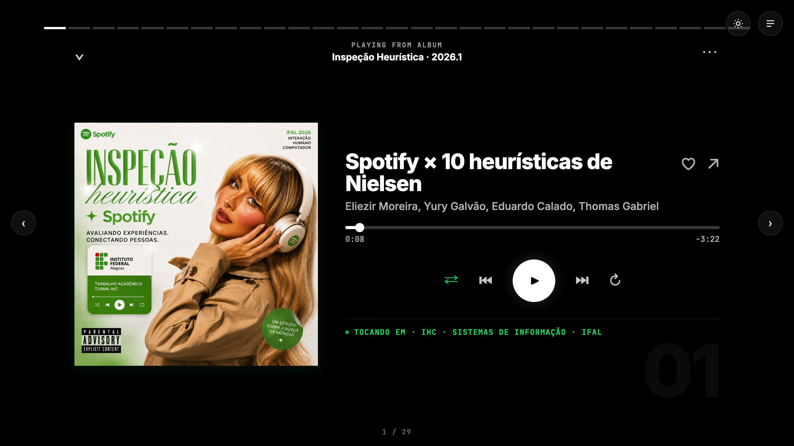
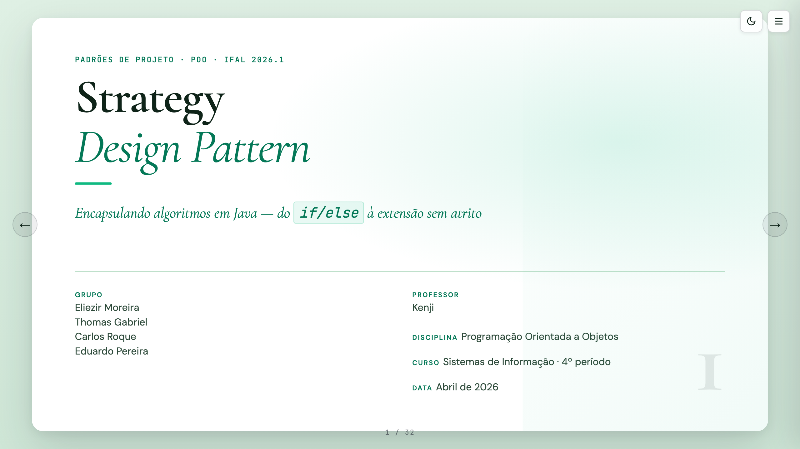
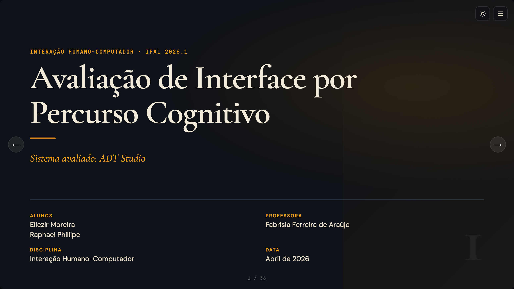

<picture>
  <source media="(prefers-color-scheme: dark)" srcset="./assets/banner-dark.png">
  <source media="(prefers-color-scheme: light)" srcset="./assets/banner-light.png">
  
</picture>

 

### Slides interativos em HTML, gerados por IA a partir do seu Markdown.

 

Projeto da disciplina de **Programação Orientada a Objetos** — IFAL

 

---

## Sobre

> Aplicação desktop que transforma suas ideias em **apresentações HTML interativas** com a ajuda de IA.

Você começa escrevendo livremente o conteúdo da sua apresentação. A IA converte esse documento em um **roteiro estruturado em Markdown**, que você ajusta conversando com ela até ficar do jeito que quer. No final, com base em um **tema visual** e em **instruções/presets** definidos por você, a IA gera a apresentação final em **HTML real** — com animações, transições, componentes interativos e tudo que a web oferece. Esqueça slides estáticos.

 

## Como funciona

 

## Exemplos

_Apresentações no estilo que o Apresenta.AI gera_

  

<table>
  <tr>
    <td align="center" width="33%" valign="top">
      
        
      <b>Heurísticas de Nielsen no Spotify</b>
       
      IHC · Avaliação heurística
        
      <a href="https://eliezir.github.io/IHC-Spotify-Heuristics-Presentation/slides/">Ver apresentação →</a>
    </td>
    <td align="center" width="33%" valign="top">
      
        
      <b>Design Pattern: Strategy</b>
       
      POO · Padrão de projeto
        
      <a href="https://eliezir.github.io/strategy/slides/">Ver apresentação →</a>
    </td>
    <td align="center" width="33%" valign="top">
      
        
      <b>Percurso Cognitivo ADT Studio</b>
       
      IHC · Inspeção de usabilidade
        
      <a href="https://eliezir.github.io/percurso-cognitivo-adt-studio/slides/">Ver apresentação →</a>
    </td>
  </tr>
</table>

 

## Funcionalidades

<table>
  <tr>
    <td width="50%" valign="top">
      <h3>Editor Markdown</h3>
      <ul>
        <li>Syntax highlighting via Monaco</li>
        <li>Preview em tempo real</li>
        <li>Auto-save periódico</li>
        <li>Indicação de alterações não salvas</li>
      </ul>
    </td>
    <td width="50%" valign="top">
      <h3>Modelos Visuais</h3>
      <ul>
        <li>Paleta de cores e tipografia customizáveis</li>
        <li>Template HTML base reutilizável</li>
        <li>Preview com conteúdo de exemplo</li>
        <li>CRUD completo de modelos</li>
      </ul>
    </td>
  </tr>
  <tr>
    <td width="50%" valign="top">
      <h3>Templates de Markdown</h3>
      <ul>
        <li>Salvar Markdown como template reutilizável</li>
        <li>Biblioteca pessoal pesquisável</li>
        <li>Usar template ao criar novo projeto</li>
        <li>Edição com preview em tempo real</li>
      </ul>
    </td>
    <td width="50%" valign="top">
      <h3>Provedores de IA</h3>
      <ul>
        <li>Suporte a Claude (Anthropic)</li>
        <li>Provedor Mock para testes</li>
        <li>Cadastro de múltiplas credenciais</li>
        <li>Teste de conexão integrado</li>
      </ul>
    </td>
  </tr>
  <tr>
    <td width="50%" valign="top">
      <h3>Projetos</h3>
      <ul>
        <li>Criar em branco ou a partir de template</li>
        <li>Listar com data de última modificação</li>
        <li>Trocar modelo visual a qualquer momento</li>
        <li>Renomear e remover</li>
      </ul>
    </td>
    <td width="50%" valign="top">
      <h3>Geração e Histórico</h3>
      <ul>
        <li>Geração de slides HTML via IA</li>
        <li>Visualização em tela cheia</li>
        <li>Histórico completo por projeto</li>
        <li>Regerar com modelo diferente</li>
        <li>Comparar versões lado a lado</li>
      </ul>
    </td>
  </tr>
</table>

 

## Stack

| Backend | Frontend | Integrações |
|:--:|:--:|:--:|
| Java 25+ | Electron | Anthropic API (Claude) |
| Spring Boot | React | Provedor Mock |
| SQLite | Monaco Editor | |
| JUnit 5 | shadcn/ui | |
| Jackson | | |
| BCrypt | | |

 

## Equipe

| | Pessoa | GitHub |
|:--:|:--|:--|
| | **Andrezza Abreu** | [@dzzabreu](https://github.com/dzzabreu) |
| | **Carlos Henrique Roque** | [@Roque-if](https://github.com/Roque-if) |
| | **Eduardo Calado** | [@doardoE](https://github.com/doardoE) |
| | **Eliezir Moreira** | [@Eliezir](https://github.com/Eliezir) |
| | **Maria Luísa Alaquoke** | [@quokequack](https://github.com/quokequack) |
| | **Thomas Pinheiro** | [@thomas-pinheiro](https://github.com/thomas-pinheiro) |

Orientação: **Prof. Fernando Kenji Kamei**

 

---

  IFAL · Programação Orientada a Objetos · 2026

